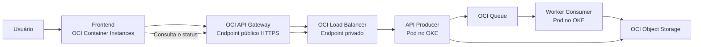
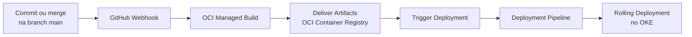

# OCI DevOps + OKE + Queue Demo

Projeto de demonstração do uso integrado dos principais serviços de DevOps e aplicações em containers da Oracle Cloud Infrastructure.

A solução apresenta um frontend executado no OCI Container Instances, uma API e um worker executados no Oracle Kubernetes Engine, processamento assíncrono com OCI Queue, armazenamento dos resultados no Object Storage e uma esteira CI/CD integrada ao GitHub.

## Objetivo da demonstração

Demonstrar, de ponta a ponta, como uma alteração realizada no GitHub pode:

1. Acionar automaticamente o OCI DevOps.
2. Construir uma nova imagem de container.
3. Publicar a imagem versionada no OCI Container Registry.
4. Iniciar o Deployment Pipeline.
5. Atualizar a aplicação no OKE.
6. Processar uma solicitação de forma assíncrona usando OCI Queue.
7. Exibir o resultado no frontend sem depender da consulta manual de logs.

## Arquitetura



## Fluxo da aplicação

1. O usuário acessa o frontend publicado no OCI Container Instances.
2. O frontend envia a solicitação de relatório para o OCI API Gateway.
3. O API Gateway encaminha a requisição para o Load Balancer privado do OKE.
4. A API, executada no OKE, registra o job e publica uma mensagem no OCI Queue.
5. O worker consome a mensagem e processa o relatório.
6. O resultado é gravado como JSON no OCI Object Storage.
7. O frontend consulta periodicamente o status do job.
8. Quando o processamento termina, o resultado é apresentado ao usuário.

A arquitetura utiliza mensageria e Object Storage, evitando a necessidade de um banco de dados para esta demonstração.

## Serviços OCI utilizados

| Serviço | Responsabilidade |
|---|---|
| OCI Container Instances | Executa o frontend estático da demonstração |
| OCI API Gateway | Disponibiliza a entrada pública HTTPS da API |
| OCI Load Balancer | Encaminha internamente o tráfego para o serviço no OKE |
| Oracle Kubernetes Engine | Executa os pods da API e do worker |
| OCI Queue | Realiza a comunicação assíncrona entre producer e consumer |
| OCI Object Storage | Armazena o resultado final dos jobs |
| OCI Container Registry | Armazena as imagens versionadas dos containers |
| OCI DevOps Build Pipeline | Valida o código, constrói e publica a imagem do backend |
| OCI DevOps Deployment Pipeline | Executa o deployment rolling no OKE |
| OCI Vault | Armazena o token utilizado na integração com o GitHub |
| OCI IAM | Controla o acesso por policies e OKE Workload Identity |

## Fluxo de CI/CD



O fluxo automatizado do backend funciona da seguinte maneira:

1. Um commit ou merge é realizado na branch `main`.
2. O GitHub envia um evento para o trigger do OCI DevOps.
3. O Managed Build utiliza o arquivo `build_spec.yaml`.
4. A aplicação é validada e uma imagem Docker é construída.
5. A imagem é publicada no OCIR com uma tag baseada no hash do commit.
6. A variável `IMAGE_URI` é enviada ao Deployment Pipeline.
7. O manifesto Kubernetes recebe a nova imagem.
8. A API e o worker são atualizados no OKE por rolling deployment.

## Estrutura do repositório

```text
.
├── backend/
│   ├── src/
│   │   ├── oci-clients.js
│   │   ├── server.js
│   │   └── worker.js
│   ├── Dockerfile
│   ├── package.json
│   └── package-lock.json
├── frontend/
│   ├── Dockerfile
│   └── index.html
├── k8s/
│   └── oke-demo.yaml
├── build_spec.yaml
└── README.md
```

## Endpoints da demonstração

- Frontend: `http://147.15.58.71/`
- API Gateway: `https://czjzhrzz22xvt3tp7zbh4umfai.apigateway.sa-saopaulo-1.oci.customer-oci.com/api`
- Health check: `/health`
- Criação de job: `POST /jobs`
- Consulta de job: `GET /jobs/{jobId}`

> Os endpoints pertencem a um ambiente temporário criado exclusivamente para a demonstração.

## Cenário apresentado

A aplicação simula a solicitação de um relatório de vendas.

Ao selecionar **Processar relatório**, o frontend acompanha as seguintes mudanças de estado:

```text
QUEUED → PROCESSING → COMPLETED
```

Ao final, o resultado é exibido na própria interface e também armazenado no Object Storage.

## Status da arquitetura

- [x] Frontend no OCI Container Instances
- [x] Entrada pública pelo OCI API Gateway
- [x] Load Balancer privado para o backend
- [x] API producer no OKE
- [x] Worker consumer no OKE
- [x] Integração com OCI Queue
- [x] Persistência no OCI Object Storage
- [x] Imagens publicadas no OCI Container Registry
- [x] Build Pipeline no OCI DevOps
- [x] Deployment Pipeline com OKE como ambiente
- [x] Integração entre GitHub e OCI DevOps
- [x] Trigger automático para alterações na branch `main`